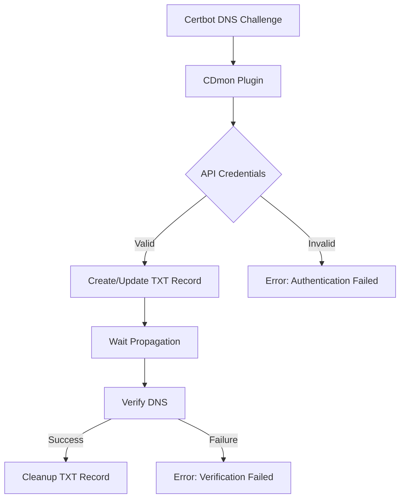

# Certbot DNS CDmon Plugin [](https://www.python.org/) [](https://certbot.eff.org/) [](https://opensource.org/licenses/MIT)

## Table of Contents
1. [Overview](#overview)
2. [Requirements](#requirements)
3. [Installation](#installation)
4. [Configuration](#configuration)
5. [Usage](#usage)
6. [Troubleshooting](#troubleshooting)
7. [Development](#development)
8. [Contributing](#contributing)
9. [License](#license)

---

## Overview <a id="overview"></a>

DNS authentication plugin for Certbot that uses the CDmon API to handle dns-01 challenges, specifically designed for wildcard certificate management.

Key features:
- Automated TXT record management via CDmon API (api-domains.cdmon.services)
- Support for multiple domain validation
- Integration with Certbot's renewal workflow
- Default TTL of 60 seconds for DNS records
- Default propagation delay of 90 seconds

---

## Requirements <a id="requirements"></a>

### Core Dependencies
- **Certbot**: ≥1.1.0 (verified with 3.3.0+)
- **Python**: 3.6+
- **Requests**: Required for API communication
- **OS**: Linux (Debian/Ubuntu/CentOS), macOS 10.15+
- See [requirements.txt](requirements.txt) for full package dependencies

### Service Requirements
- CDmon account with API access
- API key with DNS record management permissions

---

## Installation <a id="installation"></a>

### Package Installation
```bash
pip install certbot-dns-cdmon
```

### From Source
```bash
git clone https://github.com/rascazzione/certbot-dns-cdmon.git
cd certbot-dns-cdmon
pip install -e .
```

> **Security Note**: For production deployments:
> - Use environment variables for credential management
> - Implement secret vault integration
> - Rotate API keys regularly

---

## Configuration <a id="configuration"></a>

### 1. API Key Setup
1. Log in to your CDmon control panel
2. Navigate to API/Developer settings
3. Generate API key with DNS record management permissions

### 2. Credential Management
Create credentials file in one of these locations:
- System-wide: `/etc/letsencrypt/cdmon-credentials.ini`
- User-specific: `$HOME/.config/certbot/cdmon-credentials.ini`

Example configuration:
```ini
# CDmon API credentials
dns_cdmon_api_key = your_api_key_here
dns_cdmon_domain = your_domain_here
```

Security best practices:
```bash
chmod 600 /path/to/credentials.ini
```

---

## Usage <a id="usage"></a>

### Basic Certificate Request
```bash
certbot certonly \\
  --authenticator dns-cdmon \\
  --dns-cdmon-credentials /path/to/credentials.ini \\
  --dns-cdmon-propagation-seconds 180 \\
  -d example.com \\
  -d *.example.com
```

### Virtual Environment Setup
```bash
# Using venv
python -m venv venv
source venv/bin/activate
pip install -e .

# Using Conda
conda create -n certbot-env python=3.8
conda activate certbot-env
pip install -e .
```

### Non-root User Setup
```bash
certbot certonly \\
  --authenticator dns-cdmon \\
  --dns-cdmon-credentials ~/certbot/credentials.ini \\
  --dns-cdmon-propagation-seconds 90 \\
  -d example.com \\
  -d *.example.com \\
  --config-dir ~/certbot/config \\
  --work-dir ~/certbot/work \\
  --logs-dir ~/certbot/logs
```

### Automatic Renewal
Certbot will remember the plugin used. The renewal will be automatic without needing to reconfigure the plugin.

---

## Troubleshooting <a id="troubleshooting"></a>

### Common Issues

#### 1. Permission Errors
- **Solution A**: Use sudo with full path to certbot:
  ```bash
  sudo /path/to/certbot certonly [options...]
  ```
- **Solution B**: Specify writable directories:
  ```bash
  certbot certonly \\
    --config-dir ~/certbot/config \\
    --work-dir ~/certbot/work \\
    --logs-dir ~/certbot/logs
  ```

#### 2. API Authentication Errors
- Verify API key has DNS management permissions
- Check credentials file format:
  ```ini
  dns_cdmon_api_key = your_api_key
  dns_cdmon_domain = yourdomain.com
  ```

#### 3. Propagation Issues
- Increase propagation seconds (default: 90)
- Verify DNS propagation using tools like [WhatsMyDNS](https://www.whatsmydns.net/)

#### 4. API Response Codes
- 200: Success
- 401: Invalid API key
- 404: Domain not found
- 500: Server error

---

## Development <a id="development"></a>

### Authentication Flow


### Setup
```bash
git clone https://github.com/rascazzione/certbot-dns-cdmon.git
cd certbot-dns-cdmon
python -m venv venv
source venv/bin/activate
pip install -e .
```

### Testing
```bash
python -m unittest discover
```

---

## License <a id="license"></a>

This project is licensed under the MIT License - see the [LICENSE](LICENSE) file for details.

---

## Contributing <a id="contributing"></a>

Contributions are welcome. Please open an issue or pull request on GitHub.
